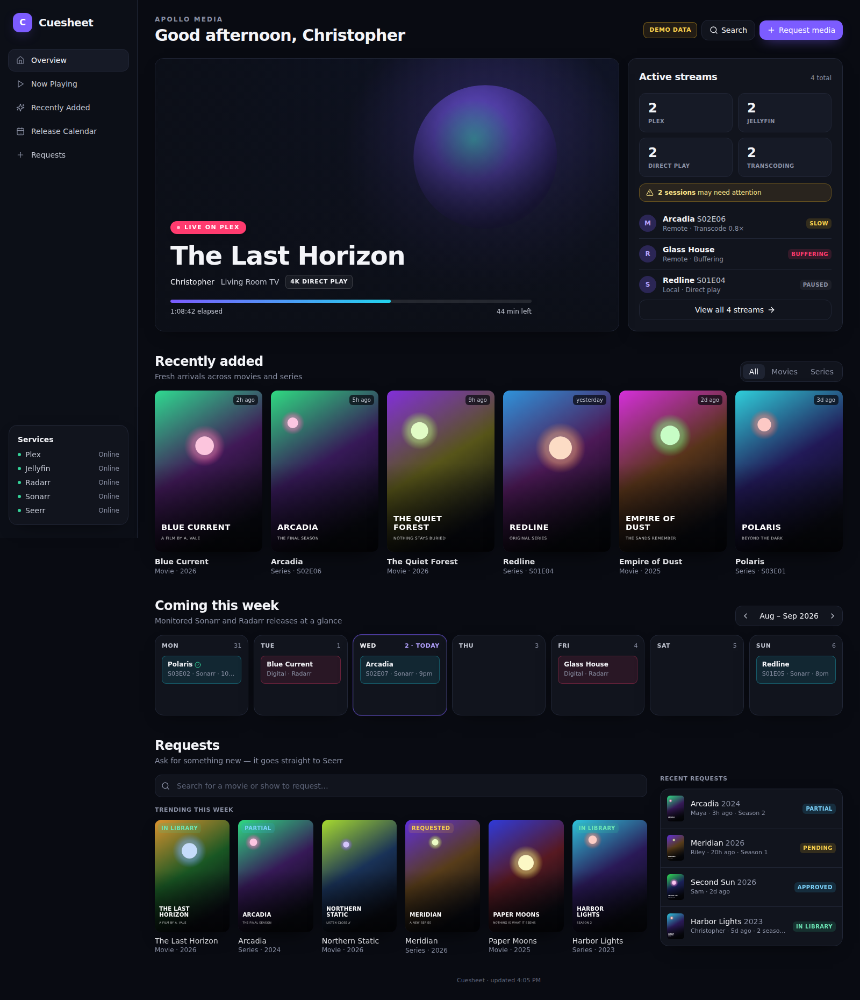

# Cuesheet

A calm, single-page media dashboard for a home server. It shows:

- **Now Playing** – active Plex and/or Jellyfin streams with poster, user, player, progress, direct/transcode and resolution.
- **Recently Added** – a poster row merged from Plex and Jellyfin, newest first.
- **This Week** – a 7-day calendar of Radarr movie releases (cinema / digital / physical) and Sonarr episode air dates, with a check mark on anything already downloaded. Step forward/back a week at a time.
- **Requests** – search and request movies or shows through Overseerr/Jellyseerr, pick seasons for TV, see what's trending, and a list of recent requests with their status.

Every service is optional: configure what you have and the rest of the page simply doesn't render. All API keys stay inside the container; the browser only ever talks to Cuesheet, and posters are proxied through it.

**Setup wizard.** On first run the app opens a setup wizard: enter each service's URL and key, hit *Test connection* to confirm it (Jellyfin and Seerr also let you pick a user from a list), and save. Settings are written to `settings.json` in the data directory (`/config` in the container) and override any environment variables. Reopen it any time from *Settings* in the sidebar. Set `ADMIN_PASSWORD` to require a password before Settings can be viewed or changed — recommended if anyone outside your household can reach the page, since the wizard has no login of its own.

Turn on *Show demo data* (or set `DEMO_MODE=true`) to see the whole dashboard populated with sample data before connecting anything. *Your name* personalises the greeting and *Server name* is the small label above it.



## Running on Unraid (Apollo)

### Option A – template (recommended)

1. Copy `unraid/cuesheet.xml` to `/boot/config/plugins/dockerMan/templates-user/` on Apollo (via the flash share or `scp`).
2. Docker tab → **Add Container** → pick **Cuesheet** from the *Template* dropdown.
3. Leave the *Config Folder* at `/mnt/user/appdata/cuesheet` and optionally set an *Admin Password*. The service URLs and keys are under *Show more settings* but you don't need them — the wizard covers it.
4. Apply. Open `http://apollo:3000` and follow the setup wizard (see [Credentials](#credentials) for where each key lives).

The template pulls `ghcr.io/twitchstick/cuesheet:latest`, which is built automatically by the GitHub Actions workflow in this repo on every push to `main` (and tagged releases like `v1.0.0`). If the package is private on GHCR, either make it public in the package settings or log in to GHCR on Apollo first.

### Option B – build the image on Apollo

If you'd rather not depend on GHCR:

```sh
git clone https://github.com/twitchstick/cuesheet.git /mnt/user/appdata/cuesheet-src
cd /mnt/user/appdata/cuesheet-src
docker build -t cuesheet:local .
```

Then add a container in the Unraid UI with repository `cuesheet:local` (or import the template and change the *Repository* field), map `/config` to `/mnt/user/appdata/cuesheet`, and open the web UI to run the wizard.

### Option C – docker compose

```sh
cp .env.example .env   # fill in your values
docker compose up -d --build
```

## Credentials

| Service | Where to find it |
| --- | --- |
| `PLEX_TOKEN` | Plex Web → any item → ⋯ → *Get Info* → *View XML*, copy `X-Plex-Token=` from the URL. |
| `JELLYFIN_API_KEY` | Jellyfin → Dashboard → API Keys → + |
| `JELLYFIN_USER_ID` (optional) | Dashboard → Users → pick a user → the id in the URL. When set, Recently Added uses that user's grouped "latest" view. |
| `RADARR_API_KEY` / `SONARR_API_KEY` | Settings → General → Security → API Key |
| `SEERR_API_KEY` | Overseerr/Jellyseerr → Settings → General → API Key |
| `SEERR_USER_ID` (optional) | Requests are created as the API key's owner unless this is set to another Seerr user id. |

Use LAN addresses on Apollo (for example `http://192.168.1.10:32400`), or `http://<container-name>:<port>` if the containers share a custom Docker network.

All environment variables are listed in `.env.example`. They are optional once the wizard has been used; a value saved in the wizard wins over the matching variable.

The container starts as root only to make `/config` owned by `PUID:PGID` (defaults `99:100`, Unraid's `nobody:users`), then drops to that user.

## Development

```sh
npm run install:all   # server + client deps
cp .env.example .env  # point at your services
npm run dev           # server on :3000, Vite client on :5173 (proxied to /api)
```

`npm run build` builds the client into `client/dist`; `npm start` serves it from the Express server.

## How it works

- `server/` – Express. One adapter per service under `server/services/`. `/api/streams`, `/api/recent` and `/api/calendar` fan out to every configured source and return `{ items, errors }`, so a single unreachable service shows a small warning instead of breaking the page. Responses are cached briefly (5 s for streams, minutes for the rest) and stale data is served if an upstream errors.
- `/api/image` – proxies posters from Plex, Jellyfin, Radarr and Sonarr so credentials are never sent to the browser. Seerr results use public TMDB poster URLs.
- `/api/settings` – read (secrets masked), update and test connections from the setup wizard; `server/config.js` merges env defaults with `settings.json`.
- `client/` – React + Vite + Tailwind. Polling pauses when the tab is hidden and resumes immediately when it becomes visible, which suits a wall-mounted display.
